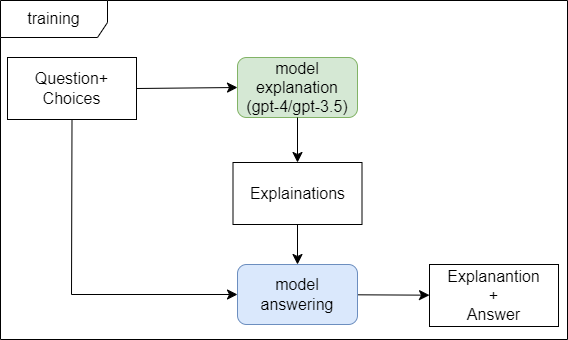
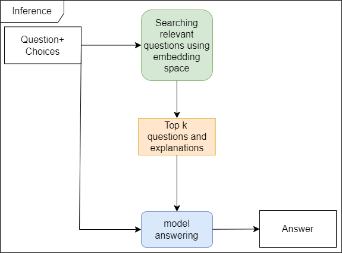

# ZAIC-2023-Elementary-Math-Solving

# Environment

## Specs

- Pytorch: 2.1.0

- CUDA: 12.1

## Installation

```bash
pip install -r requirements.txt
```

```bash
huggingface-cli login
wandb login
```

# Solution overview

## Overview


The training steps of the model include 2 stages:

- Continue pretraining: Using text corpus collected from external data about elementary school mathematics knowledge, some types of exercises to help LLM align with mathematical knowledge.

- Finetuning: Using the dataset provided by the organizers and some filtered data in the format Question, Choices, Explanation, Answer to train Reasoning for the model from Stage 1.

## Finetune



We train the model followwing instruction with the input being Question + Choices and the output being Explanation + Answer.

The input data is filled with complete explanations to ensure the model always makes inferences before giving an answer.

## Inference

Using [intfloat/e5-base](https://huggingface.co/intfloat/e5-base) as embedding model



In the inference phase, we use a few-shot prompting, using an additional embedding model to find the top-k samples that are most similar to the question + input choice. We then post-process and give the final answer.

# Data Curation

In this section, we will provide the data sets used and processing directions to create data sets for the two stages of Continue Pretraining and Finetuning.

## Data from Competition

This is the original data provided by the contest organizers. We used models such as GPT-3.5, GPT-4 to process the data, as well as create manual data sets for evaluation in development environment. All datasets are placed in datasets/.

All processed datasets:

| Dataset Name                                     | Description                                                                        | Size | Filename                               | Note                               |
|--------------------------------------------------|------------------------------------------------------------------------------------|------|----------------------------------------|------------------------------------|
| Original Train                                   | training dataset from competition organizer                                        | 1200 | math_train.json, with explanation: 537 | Only a few with explanation |
| GPT3.5 Generate Explanation                      | Using GPT3.5 to generate explanation fields                                        | 1200 | with-missing-explain-3.5.json          |                                    |
| GPT4 Generate Explanation                        | Using GPT4 to generate explanation fields                                          | 1200 | with-missing-explain-4.json            |                                    |
| Public Test                                      | public test dataset from competition organizer                                     | 189  | math_test.json                         | Several questions with no answer   |
| Public Test with Hand Label for Local Evaluation | add answer fields to public test dataset                                           | 189  | math_test_with_hand_label.json         |                                    |
| Crawled Hand Label Public Test                   | Create a similar public test dataset for evaluation                                | 140  | validation/convert_collect_data.json   |                                    |
| Qualified dataset for Finetune                   | Combination of Cleaned Original Train  Missing Explanation with Generated by GPT-4 | 1349 | qualified_data.json                    |                                    |

## External Datasets
We rely mainly on crawling online teaching websites for elementary school students and the benchmark dataset is translated into Vietnamese to take advantage of the above two stages.

External datasets:

| Dataset Name                                       | Description                                                                         | Size  | Link                                                          | Note                                                      |
|----------------------------------------------------|-------------------------------------------------------------------------------------|-------|---------------------------------------------------------------|-----------------------------------------------------------|
| Vietnamese Translated Grade School Math Dataset    | Using GPT3.5 to translate Grade School Math Dataset 8K.                             | 8792  | https://huggingface.co/datasets/hllj/vi_gsm8k                 | a text2text Generation dataset.                           |
| Vietnamese Grade School Math - Multiple Choice     | Crawled math solving pages from grade 1 to grade 5 in https://khoahoc.vietjack.com/ | 2733  | https://huggingface.co/datasets/hllj/vi_grade_school_math_mcq | each page contains multiple-choice math questions.        |
| Vietnamese Elementary Math Knowledge and Workbook  | Crawled dataset of text corpus in https://tech12h.com/                              | 10246 | https://huggingface.co/datasets/hllj/vi_math_problem_crawl    | text corpus about math and problem in books for students. |

## Continue pretraining Dataset

The dataset will follow the continue pretrain direction with text corpora and training for 1 epoch. All datasets for pretraining are in datasets/pretrain/.

| Dataset Name                                             | Filename                            | Size  |
|----------------------------------------------------------|-------------------------------------|-------|
| Vietnamese Translated Grade School Math Dataset          | vi_train_raw.json, vi_test_raw.json | 8792  |
| Vietnamese Elementary Math Knowledge and Workbook - Text | grade_{1,5}.json                    | 10246 |
| Vietjack Text                                            | vietjack_pretrain.json              | 13615 |
| Total                                                    |                                     | 32653 |

## Finetuning Dataset

Finetuning data set is created from the competition dataset plus with external datasets with multiple-choice format, in addition to adding data, we also filter out some erroneous data or missing explanations to increase the model's inference ability. All datasets for finetuning are in datasets/finetune/.

| Dataset Name                                      | Description                                                                            | Filename                    | Size |
|---------------------------------------------------|----------------------------------------------------------------------------------------|-----------------------------|------|
| Qualified Dataset from Competition                | Qualified dataset + GPT-4 Fill Explanation                                             | convert_qualified_data.json | 1196 |
| Collected Dataset                                 | From Crawled Hand Label Public Test that we collected, similar to public test dataset. | convert_qualified_data.json | 140  |
| Vietnamese Elementary Math Knowledge and Workbook | Convert to multiple-choice question format by generating 3 more false answers.         | grade_{3,5}_mcq.json        | 5206 |
| Vietnamese Grade School Math - Multiple Choice    | Filtering questions with long explanation.                                             | vietjack_finetune.json      | 2115 |
| Total                                             |                                                                                        |                             | 8657 |

# Training Script

## Baseline with Llama-2-7b LoRA 8bit

### Baseline Llama-2-7b LoRA 8bit

```bash
python llama_recipes/finetuning.py --use_peft --peft_method lora --quantization --model_name meta-llama/Llama-2-7b-hf --output_dir outputs
```

### Finetuning with llama_recipes (deprecated - not using in final solution)

model baseline: zephyr-7b-alpha
with zalo_math_fill_missing_explain_4 (using GPT4)

now with `load_in` options `['4bit', '8bit']`

```bash
python llama_recipes/finetuning.py --use_peft --peft_method lora --quantization --model_name HuggingFaceH4/zephyr-7b-alpha --dataset zalo_math_fill_missing_explain_35 --output_dir outputs --use_wandb --wandb_entity baolocpham --wandb_key KEY --num_epochs 2
```

```bash
python llama_recipes/finetuning.py --use_peft --peft_method lora --quantization --model_name HuggingFaceH4/zephyr-7b-alpha --dataset zalo_math_fill_missing_explain_4 --output_dir outputs --max_length 2048 --num_epochs 6 --load_in 4bit --use_wandb --wandb_entity baolocpham --wandb_key KEY
```

## Final Solution

### Pretraining

```bash
bash run_pt.sh
```

### Finetune with SFTTrainer

using [HuggingFaceH4/zephyr-7b-beta](https://huggingface.co/HuggingFaceH4/zephyr-7b-beta) as base model

```bash
ACCELERATE_LOG_LEVEL=info accelerate launch --config_file <multi_gpu.yaml / deepspeed_zero3.yaml> --num_processes=1 sft.py config_lora.yaml
```

Ex:

```bash
ACCELERATE_LOG_LEVEL=info accelerate launch --config_file multi_gpu.yaml --num_processes=1 sft.py config_lora.yaml
```

# Inference

## Quantization inference 4bit / 8bit
```bash
python inference.py --model_name hllj/zephyr-7b-beta-vi-math --peft_model outputs-sft-zephyr-beta-v1/checkpoint-1500/ --load_in 4bit/8bit --max_new_tokens 512 --temperature 0.1
```

- model_name: base model using for finetuning
- peft_model: folder contains LoRA finetune output
- load_in: 4bit / 8bit quantization
- max_new_tokens: maximum generating tokens
- temperature: temperature for sampling (we're chosing range from 0.1 to 0.5)

# Inference with vLLM

## Merge base model with LoRA

Because when inference with vLLM, it doesn't allow using LoRA outputs but the merged weights itself

```bash
python merge_peft_adapter.py --model_type auto --base_model <name or path base model> --tokenizer_path <name or path tokenizer> --lora_model <lora folder> --output_dir <output folder for merged model>
```

Ex:
```bash
python merge_peft_adapter.py --model_type auto --base_model hllj/mistral-vi-math --tokenizer_path lora --lora_model lora --output_dir final
```

# Experiment

## Continue pretraining

| Base model      | Train loss         | Eval loss          | Eval_Accuracy      | Eval_Perplexity    |
|-----------------|--------------------|--------------------|--------------------|--------------------|
| Llama-2 7B      | 0.5671561380291116 | 0.6204795241355896 | 0.831146229075127  | 1.8598196564670118 |
| Mistral-7b-v0.1 | 0.5717931843230705 | 0.605161726474762  | 0.8357321441998862 | 1.8315483947998228 |
| zephyr-7b-beta  | 0.5778149476435406 | 0.6088958978652954 | 0.8344175985305018 | 1.838400495913874  |
| Qwen-7B         | 0.9038185586734694 | 0.9308816194534302 | 0.7710786622703721 | 2.5367446354805163 |
| BloomZ-7b1      | 1.2220947331637801 | 1.241927146911621  | 0.7222003923855691 | 3.4622793605962974 |

## Finetune

| Base model                  | Finetuning                                           | Train loss | Eval loss    | public test acc |
|-----------------------------|------------------------------------------------------|------------|--------------|-----------------|
| hllj/mistral-vi-math        | BaoLocTown/sft-mistral-7b-vi-math-v1-clean-valid     | 0.2929     | 0.4370269775 | 0.5238          |
| hllj/Zephyr-beta-7B-Vi-Math | BaoLocTown/sft-zephyr-beta-7b-vi-math-v1-clean-valid | 0.2968     | 0.4378368258 | 0.6878          |
| hllj/Llama2-7B-Vi-Math      | BaoLocTown/sft-llama2-7b-vi-math-v1-clean-valid      | 0.3555     | 0.4689075351 | 0.4126                 |

## Inference

```bash
python inference_vllm.py --model_path <output folder for merged model> --max_new_tokens 1024 --temperature 0.1 --output_filepath submission.csv
```

Ex:
```bash
python inference_vllm.py --model_path final --max_new_tokens 1024 --temperature 0.1 --output_filepath submission.csv
```
